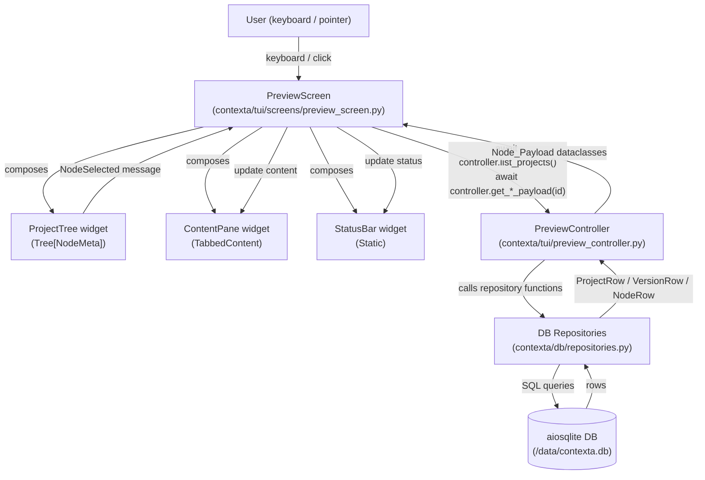
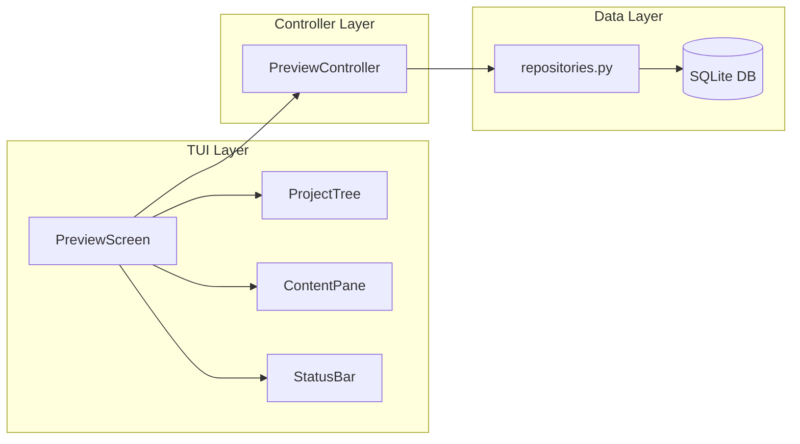
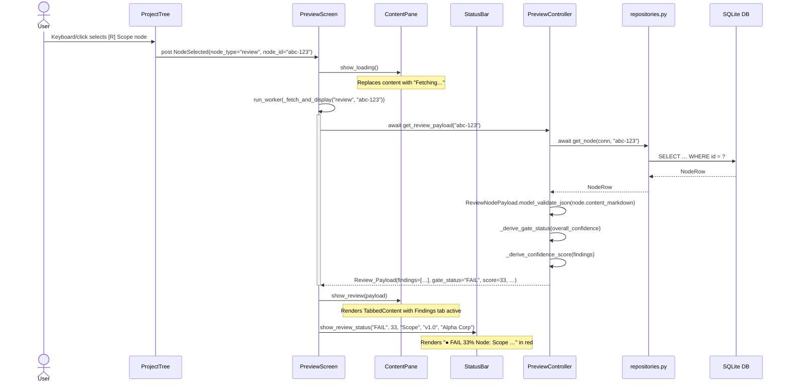
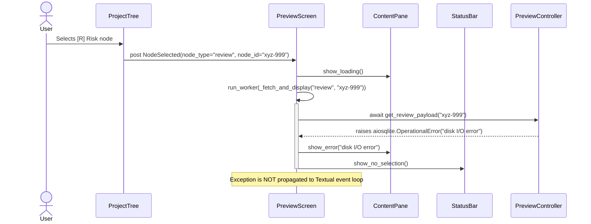

# Design Document: TUI IDE Interface

## Overview

The TUI IDE Interface adds a `PreviewScreen` to Contexta — a terminal-native "IDE for Project Delivery" that lets users navigate the full data hierarchy (Project → Version → Review → Proposal/Prompt) and read AI-generated findings, proposals, and prompts comfortably inside the terminal.

### Design Goals

- **Zero business logic in the TUI layer.** All data retrieval, Gate_Status derivation, and score computation live in a thin `PreviewController`. Widgets receive pre-computed values and render them.
- **VS Code sidebar, calm reader pane.** The tree sidebar mimics VS Code's file-explorer aesthetic (inverted-colour selection, type-prefix icons). The content pane prioritises long-read comfort: generous padding, foreground-only semantic colours, no filled badge backgrounds.
- **Additive only.** `MainScreen`, the pipeline, and all 596+ existing tests are completely unchanged.
- **Single-container Docker.** A `docker-compose.yml` at the repository root lets any user start the full application with `docker compose up`, no Python installation required.

### Technology Stack

| Concern | Choice | Rationale |
|---|---|---|
| TUI framework | Textual ≥ 0.47 | Already in `pyproject.toml`; mature widget set including `Tree`, `TabbedContent`, `Markdown` |
| Tree widget | Textual built-in `Tree[NodeMeta]` | Collapsible nodes, keyboard navigation, and inverted-colour selection are provided out of the box |
| Tabbed content | Textual `TabbedContent` | Manages tab lifecycle and content switching natively |
| Markdown rendering | Textual `Markdown` | Already used elsewhere in the Textual ecosystem; no extra dependency |
| Node payload schemas | Python `dataclasses` | Lightweight, JSON-serialisable via `dataclasses.asdict()`, no Pydantic overhead in the TUI layer |
| Property-based testing | Hypothesis (already in `dev` extras) | Needed for round-trip and computation properties |
| Async workers | Textual `Worker` (via `run_worker`) | Non-blocking data fetch without blocking the event loop |


---

## Architecture

### System Architecture Diagram



### Component Layer Diagram



The TUI Layer contains **zero business logic**. The Controller Layer bridges TUI and Data layers. The Data Layer is the existing, unmodified `repositories.py`.


---

## Screen Layout Blueprint

The `PreviewScreen` uses Textual's `compose()` model. The overall layout is a three-zone vertical stack: a header bar, a horizontal split body, and a persistent status bar.

```
┌──────────────────────────────────────────────────────────────────────────────┐
│  Contexta  ·  Preview Mode                                        [?] Help   │
├────────────────────────┬─────────────────────────────────────────────────────┤
│  SIDEBAR  (28 cols)    │  CONTENT PANE  (1fr remaining width)                │
│  ──────────────────    │                                                      │
│  ▼ [P] Alpha Corp      │  ┌──────────┬───────────┬──────────────────────┐   │
│     ▼ [V] v1.0         │  │ Findings │ Proposal  │ Prompt               │   │
│        ▼ [R] Scope     │  └──────────┴───────────┴──────────────────────┘   │
│           [D] Proposal  │                                                     │
│           [T] Prompt   │  Dimension: Intent                       ● RED      │
│        ▶ [R] Risk      │  ────────────────────────────────────────────────   │
│     ▶ [V] v2.0         │  Summary: No intent statement found in the         │
│  ▶ [P] Beta LLC        │  submitted document.                                │
│                        │                                                      │
│  (loading / error /    │  Detail: The document does not contain a clear      │
│   empty state here)    │  statement of intent for the proposed solution.     │
│                        │  Reviewers require explicit scope boundaries...     │
│                        │                                                      │
│                        │  ────────────────────────────────────────────────   │
│                        │  Dimension: Scope                      ● AMBER      │
│                        │  ────────────────────────────────────────────────   │
│                        │  Summary: Scope is partially defined.               │
│                        │  ...                                                 │
├────────────────────────┴─────────────────────────────────────────────────────┤
│  ● FAIL  33%   Node: Scope Review  ·  Version: v1.0  ·  Project: Alpha Corp  │
└──────────────────────────────────────────────────────────────────────────────┘
```

**Layout rules:**
- Sidebar: fixed `width: 28` (Textual CSS units).
- Content pane: `width: 1fr` (takes all remaining horizontal space).
- Status bar: `height: 1` (single terminal line), `dock: bottom`.
- The header is Textual's built-in `Header` widget with `show_clock=False`.
- A `Horizontal` container wraps the sidebar and content pane.


---

## Components and Interfaces

### `PreviewScreen` (`contexta/tui/screens/preview_screen.py`)

**Responsibility:** Master layout screen. Composes the three child widgets, routes `NodeSelected` messages to the correct `PreviewController` call, and distributes loaded payloads to `ContentPane` and `StatusBar`.

**Key design decision:** `PreviewController` is injected at construction time so the screen can be unit-tested by passing a stub.

```python
class PreviewScreen(Screen):
    BINDINGS = [
        Binding("escape", "back", "Back", show=True, priority=True),
        Binding("q",      "back", "Quit preview", show=False),
    ]

    def __init__(self, controller: "PreviewController", **kwargs) -> None:
        super().__init__(**kwargs)
        self._controller = controller

    def compose(self) -> ComposeResult:
        yield Header(show_clock=False)
        with Horizontal(id="preview-split"):
            yield ProjectTree(controller=self._controller, id="project-tree")
            yield ContentPane(id="content-pane")
        yield StatusBar(id="status-bar")

    def on_project_tree_node_selected(self, event: "ProjectTree.NodeSelected") -> None:
        """Route a tree selection to the appropriate controller call."""
        self.run_worker(
            self._fetch_and_display(event.node_type, event.node_id),
            exclusive=True,
            name="preview-fetch",
        )

    async def _fetch_and_display(self, node_type: str, node_id: str) -> None: ...

    def action_back(self) -> None:
        self.app.pop_screen()
```

---

### `ProjectTree` (`contexta/tui/screens/preview_screen.py` — inner widget)

**Responsibility:** Wraps Textual's `Tree[NodeMeta]` to provide the VS Code-style collapsible navigation sidebar.

**`NodeMeta` dataclass** (stored in each `TreeNode.data`):

```python
@dataclass
class NodeMeta:
    node_type: str   # "project" | "version" | "review" | "proposal" | "prompt"
    node_id:   str   # UUID
```

**Label format** (`_format_label` static method):

| `node_type` | Prefix | Example label |
|---|---|---|
| `"project"` | `[P]` | `[P] Alpha Corp` |
| `"version"` | `[V]` | `[V] v1.0` |
| `"review"` | `[R]` | `[R] Scope` |
| `"proposal"` | `[D]` | `[D] Proposal` |
| `"prompt"` | `[T]` | `[T] Prompt` |

**`NodeSelected` message:**

```python
class NodeSelected(Message):
    def __init__(self, node_type: str, node_id: str) -> None:
        super().__init__()
        self.node_type = node_type
        self.node_id = node_id
```

**Lifecycle:**
1. `on_mount()` → calls `self.run_worker(self._load_projects(), ...)` — shows "Loading projects…" `Static` while running.
2. Worker resolves → replaces loading `Static` with populated `Tree`.
3. On `Tree.NodeExpanded` event → if children not yet loaded, lazy-fetches them via controller.
4. On `Tree.NodeSelected` event → posts `ProjectTree.NodeSelected` message.


---

### `ContentPane` (`contexta/tui/screens/preview_screen.py` — inner widget)

**Responsibility:** Main reading area. Renders the correct view for the selected node type using a `TabbedContent` for Review nodes and a summary card for Project/Version nodes.

**Internal states:**

| State | Widget shown |
|---|---|
| `WELCOME` | `Static` welcome card with keyboard shortcuts |
| `LOADING` | `Static` "Fetching…" indicator |
| `PROJECT` | `Static` project summary card |
| `VERSION` | `Static` version summary card |
| `REVIEW` | `TabbedContent` with Findings / Proposal / Prompt tabs |
| `ERROR` | `Static` error message (red foreground) |

**Public API called by `PreviewScreen`:**

```python
class ContentPane(Widget):
    def show_welcome(self) -> None: ...
    def show_loading(self) -> None: ...
    def show_project(self, payload: "Project_Payload") -> None: ...
    def show_version(self, payload: "Version_Payload") -> None: ...
    def show_review(self, payload: "Review_Payload") -> None: ...
    def show_error(self, message: str) -> None: ...
```

**Findings tab rendering** (for each `IssueFinding` in `Review_Payload.findings`):
- Row layout: `[DIMENSION LABEL]` + confidence badge (coloured) + `[HR]` + summary text + detail text.
- Confidence coloring applied via Textual markup: `f"[{color}]{text}[/{color}]"` where `color = "red"` for `RED`, `"yellow"` for `AMBER`, and `"default"` for `GREEN`.
- Each finding is separated by a `Rule` widget or a `"─" * width` divider `Static`.

**Proposal tab rendering:**
- If `content_markdown` stripped is empty → render `Static("No proposal generated for this review.")`.
- Otherwise → render `Markdown(content_markdown)`.

**Prompt tab rendering:**
- Render prompt_text inside a `ScrollableContainer` with CSS class `monospace-area` (mapped to a monospace-adjacent Textual color variable with `font-family: monospace` in CSS).

---

### `StatusBar` (`contexta/tui/screens/preview_screen.py` — inner widget)

**Responsibility:** Single-line persistent footer showing Gate_Status (with semantic colour) and Delivery_Confidence_Score for the active Review node.

```python
class StatusBar(Widget):
    DEFAULT_CSS = """
    StatusBar {
        dock: bottom;
        height: 1;
        padding: 0 2;
        background: $surface1;
    }
    """

    def show_review_status(
        self,
        gate_status: str,           # "PASS" | "WARN" | "FAIL"
        confidence_score: int,      # 0–100
        node_name: str,
        version_name: str,
        project_name: str,
    ) -> None: ...

    def show_no_selection(self) -> None: ...
```

**Gate_Status colour mapping** (Textual markup):

| `gate_status` | Textual colour | Example rendered text |
|---|---|---|
| `"PASS"` | `"green"` | `● PASS  100%   Node: …` |
| `"WARN"` | `"yellow"` | `● WARN  67%    Node: …` |
| `"FAIL"` | `"red"` | `● FAIL  33%    Node: …` |
| (none) | default | `— No node selected —` |

---

### `PreviewController` (`contexta/tui/preview_controller.py`)

**Responsibility:** Thin async adapter. Reads from existing repository functions, derives Gate_Status and Delivery_Confidence_Score, and returns typed `Node_Payload` dataclasses. Contains no TUI imports.

```python
class PreviewController:
    def __init__(self, db_conn: aiosqlite.Connection) -> None:
        self._conn = db_conn

    async def list_projects(self) -> List[Project_Payload]: ...
    async def get_version_payload(self, version_id: str) -> Optional[Version_Payload]: ...
    async def get_review_payload(self, node_id: str) -> Optional[Review_Payload]: ...
    async def get_proposal_payload(self, node_id: str) -> Optional[Proposal_Payload]: ...
    async def get_prompt_payload(self, node_id: str) -> Optional[Prompt_Payload]: ...

    @staticmethod
    def _derive_gate_status(overall_confidence: ConfidenceEnum) -> str:
        _MAP = {
            ConfidenceEnum.GREEN: "PASS",
            ConfidenceEnum.AMBER: "WARN",
            ConfidenceEnum.RED:   "FAIL",
        }
        return _MAP[overall_confidence]

    @staticmethod
    def _derive_confidence_score(findings: List[IssueFinding]) -> int:
        if not findings:
            return 0
        green_count = sum(1 for f in findings if f.confidence == ConfidenceEnum.GREEN)
        return int(green_count / len(findings) * 100)
```

**Dependency rule:** The controller imports `aiosqlite`, `contexta.db.repositories`, `contexta.models.*`, and the payload dataclasses. It imports **nothing** from `contexta.tui`, `contexta.pipeline`, `contexta.llm`, or `contexta.admin`.


---

## Data Models

All Node_Payload types are Python `dataclasses` that live in `contexta/tui/preview_controller.py`. They are JSON-serialisable via `dataclasses.asdict()` + `json.dumps()`.

### `FindingRow` (embedded in `Review_Payload`)

```python
@dataclass
class FindingRow:
    dimension:    str   # ReviewDimensionEnum.value — e.g. "Intent"
    confidence:   str   # ConfidenceEnum.value — "RED" | "AMBER" | "GREEN"
    summary:      str
    detail:       str
```

### `Project_Payload`

```python
@dataclass
class Project_Payload:
    id:          str
    name:        str
    global_tags: List[str]
    version_ids: List[str]   # ordered list of version UUIDs for this project
```

### `Version_Payload`

```python
@dataclass
class Version_Payload:
    id:         str
    project_id: str
    name:       str
    created_at: str          # ISO-8601 UTC string; "N/A" if absent
    node_ids:   List[str]    # ordered list of node UUIDs for this version
```

### `Review_Payload`

```python
@dataclass
class Review_Payload:
    id:                       str
    node_name:                str
    layer_type:               str   # "exploration" | "synthesis"
    findings:                 List[FindingRow]
    gate_status:              str   # "PASS" | "WARN" | "FAIL"
    delivery_confidence_score: int  # 0–100, truncated toward zero
    prompt_text:              str   # raw LLM prompt stored on the node
```

**Round-trip contract:** `json.dumps(dataclasses.asdict(payload))` → `json.loads(...)` → reconstruct via `Review_Payload(**d, findings=[FindingRow(**f) for f in d["findings"]])` must produce an object where every field equals the original.

### `Proposal_Payload`

```python
@dataclass
class Proposal_Payload:
    id:               str
    node_id:          str
    content_markdown: str   # may be empty string
```

### `Prompt_Payload`

```python
@dataclass
class Prompt_Payload:
    id:          str
    node_id:     str
    prompt_text: str
```

### Mapping from DB Rows to Node_Payloads

| DB row type | Source fields | Payload fields |
|---|---|---|
| `ProjectRow` | `id`, `name`, `global_tags` | Direct; `version_ids` from `list_versions_for_project()` |
| `VersionRow` | `id`, `project_id`, `name`, `created_at` | Direct; `node_ids` from `list_nodes_for_project()` filtered by `version_id` |
| `NodeRow` (review) | `id`, `node_name`, `layer_type`, `content_markdown` | `content_markdown` is parsed via `ReviewNodePayload.model_validate_json()` to extract `findings`, `overall_confidence` |
| `NodeRow` (proposal) | `id`, `id`, `content_markdown` | `content_markdown` field used directly as `content_markdown` in `Proposal_Payload` |
| `NodeRow` (prompt) | `id`, stored `raw_llm_response` inside `ReviewNodePayload` | `prompt_text` from `ReviewNodePayload.raw_llm_response` |

**Note on Proposal vs Prompt:** A single `NodeRow` stores the full `ReviewNodePayload` JSON in `content_markdown`. The controller derives:
- `Proposal_Payload.content_markdown` from the node's `content_markdown` field (the raw proposal text stored there, or an empty string if the node has no proposal yet).
- `Prompt_Payload.prompt_text` from `ReviewNodePayload.raw_llm_response` (the master prompt used to generate the review).


---

## Textual CSS / Styling Strategy

### Design Philosophy

- **No filled badge backgrounds.** All semantic colours are applied as foreground-only markup or CSS `color` rules, never as `background`.
- **Restrained decoration.** Only one border style (`solid $surface3`) used for card containers; no `double` or `heavy` borders.
- **Typography over chrome.** Generous padding inside cards (`padding: 1 2`); no drop shadows or gradients.

### Color Tokens (mapped to Textual CSS variables)

| Token name | Textual variable | Hex equivalent | Usage |
|---|---|---|---|
| `background` | `$background` | `#0d1117` | App and screen background |
| `surface1` | `$surface` | `#161b22` | Sidebar background, StatusBar background |
| `surface2` | `$panel` | `#21262d` | Card and tab container background |
| `surface3` | `$boost` | `#30363d` | Card borders, divider lines |
| `accent` | `$accent` | `#58a6ff` | Active tab underline, selected node highlight |
| `text_primary` | `$text` | `#e6edf3` | Body text |
| `text_dim` | `$text-muted` | `#8b949e` | Secondary labels, timestamps |
| `green` | `$success` | `#3fb950` | PASS status, GREEN confidence |
| `amber` | `$warning` | `#d29922` | WARN status, AMBER confidence |
| `red` | `$error` | `#f85149` | FAIL status, RED confidence |

### Layout Rules

```css
/* preview_screen.py DEFAULT_CSS */

PreviewScreen {
    layout: vertical;
}

#preview-split {
    height: 1fr;
    layout: horizontal;
}

ProjectTree {
    width: 28;
    background: $surface;
    border-right: solid $boost;
    padding: 0 1;
    overflow-y: auto;
}

ContentPane {
    width: 1fr;
    background: $panel;
    padding: 1 2;
    overflow-y: auto;
}

StatusBar {
    dock: bottom;
    height: 1;
    background: $surface;
    padding: 0 2;
    color: $text-muted;
}

/* Findings tab */
.finding-row {
    padding: 1 0;
    border-bottom: solid $boost;
}

.finding-dimension {
    text-style: bold;
}

.finding-red {
    color: $error;
}

.finding-amber {
    color: $warning;
}

.finding-summary {
    color: $text;
    padding-top: 0;
}

.finding-detail {
    color: $text-muted;
    padding-top: 0;
}

/* Prompt tab */
.monospace-area {
    background: $surface;
    padding: 1 2;
    border: solid $boost;
    overflow-y: auto;
    height: 1fr;
}

/* Summary card */
.summary-card {
    border: solid $boost;
    padding: 1 2;
    height: auto;
}

.summary-label {
    color: $text-muted;
    text-style: italic;
}

/* Loading / Error / Empty states */
.state-indicator {
    color: $text-muted;
    padding: 1 2;
    text-align: center;
}

.state-error {
    color: $error;
    padding: 1 2;
}
```

### Active Tab Indicator

Textual's `TabbedContent` applies `--accent-color` to the active tab underline. No additional CSS is needed; the default Textual theme maps `--accent-color` to `$accent` (`#58a6ff`), which matches the design spec.

### VS Code Tree Selection Style

Textual's `Tree` widget applies `color: $background; background: $foreground;` to the selected node row via the built-in `--highlight-color` and `--highlight-foreground`. This produces the inverted-color (dark text on light background) selection that VS Code users recognise. No custom CSS override is needed.


---

## State Management

### Selection Event Flow

All state changes are driven by Textual messages. There is no shared mutable state between widgets — each widget receives a method call from `PreviewScreen` after the screen resolves the message.

```
User selects Tree node
        │
        ▼
ProjectTree.on_tree_node_selected(event)
  │  validates event.node.data is NodeMeta
  │  posts ProjectTree.NodeSelected(node_type, node_id)
        │
        ▼
PreviewScreen.on_project_tree_node_selected(event)
  │  calls ContentPane.show_loading()
  │  launches Worker: _fetch_and_display(node_type, node_id)
        │
        ▼ (Worker thread — non-blocking)
PreviewScreen._fetch_and_display(node_type, node_id)
  │  calls controller.get_*_payload(node_id)
  │
  ├─ if node_type == "review":
  │     payload = Review_Payload
  │     calls ContentPane.show_review(payload)
  │     calls StatusBar.show_review_status(gate_status, score, ...)
  │
  ├─ if node_type == "project":
  │     payload = Project_Payload
  │     calls ContentPane.show_project(payload)
  │     calls StatusBar.show_no_selection()
  │
  ├─ if node_type == "version":
  │     payload = Version_Payload
  │     calls ContentPane.show_version(payload)
  │     calls StatusBar.show_no_selection()
  │
  ├─ if node_type in ("proposal", "prompt"):
  │     payload = Proposal_Payload | Prompt_Payload
  │     calls ContentPane.show_review(parent_review_payload)
  │       with active tab = "Proposal" or "Prompt"
  │     calls StatusBar.show_review_status(...)
  │
  └─ if controller raises exception:
        calls ContentPane.show_error(str(exception))
        calls StatusBar.show_no_selection()
```

### Expanded/Collapsed State Preservation

Textual's `Tree` widget tracks expanded/collapsed state per `TreeNode` internally. When a node is collapsed, its children remain in the DOM but are hidden. When re-expanded, children reappear without a new fetch. This means:
- Child nodes are **lazy-loaded once** on first expansion.
- Subsequent collapse/re-expand cycles use the already-loaded children.
- The expanded state of all descendant nodes is preserved through parent collapse/re-expand because the Tree widget's internal state is not cleared.

**Implementation detail:** `ProjectTree` maintains a `_loaded_nodes: set[str]` to track which node IDs have had their children fetched. `on_tree_node_expanded` checks this set before making a controller call:

```python
async def _on_tree_node_expanded(self, event: Tree.NodeExpanded) -> None:
    meta: NodeMeta = event.node.data
    if meta.node_id not in self._loaded_nodes:
        await self._load_children(event.node, meta)
        self._loaded_nodes.add(meta.node_id)
```


---

## Loading and Error States

Each widget manages its own internal state. `PreviewScreen` drives transitions by calling the widget's public API methods.

### `ProjectTree` States

| State | Trigger | Widget shown |
|---|---|---|
| `LOADING` | `on_mount()` before worker resolves | `Static("Loading projects…", classes="state-indicator")` replaces Tree |
| `LOADED` | Worker resolves with ≥1 projects | `Tree[NodeMeta]` replaces loading indicator |
| `EMPTY` | Controller returns `[]` | `Static("No projects found. Run a review to get started.", classes="state-indicator")` |
| `ERROR` | Controller raises exception | `Static("Could not load projects: {error}", classes="state-error")` |

**Implementation:** `ProjectTree` composes a `ContentSwitcher` (or uses `remove()` / `mount()`) to swap between `Static` and `Tree` states. Alternatively, the `Tree` and the `Static` indicators can coexist; the inactive ones are set `display: none`.

### `ContentPane` States

| State | Trigger | Content shown |
|---|---|---|
| `WELCOME` | Screen mounts, no selection | `Static` welcome card with keyboard shortcuts list |
| `LOADING` | Tree selection received, before fetch | `Static("Fetching…", classes="state-indicator")` at top of pane |
| `PROJECT` | `show_project(payload)` called | Summary card: name, "Project" label, N/A timestamp, version child list |
| `VERSION` | `show_version(payload)` called | Summary card: name, "Version" label, `created_at`, review child list |
| `REVIEW` | `show_review(payload)` called | `TabbedContent`: Findings tab (default), Proposal tab, Prompt tab |
| `ERROR` | `show_error(message)` called | `Static(message, classes="state-error")` — previously loaded content replaced |

**Error overlay rule:** When `show_error()` is called, any existing content is removed before the error message is displayed. There is no opacity reduction on prior content (this simplifies the implementation while meeting the spirit of Requirement 2.11).

### `StatusBar` States

| State | Trigger | Text displayed |
|---|---|---|
| `NO_SELECTION` | Screen mounts, non-review selected, error | `— No node selected —` (default colour) |
| `REVIEW_ACTIVE` | Review node payload loaded | `● {gate_status_colour}GATE{/}  {score}%   Node: {name}  ·  Version: {v}  ·  Project: {p}` |


---

## Sequence Diagrams

### Core Interaction: User Selects a Review Node



### Error Path: Controller Raises Exception




---

## Correctness Properties

*A property is a characteristic or behavior that should hold true across all valid executions of a system — essentially, a formal statement about what the system should do. Properties serve as the bridge between human-readable specifications and machine-verifiable correctness guarantees.*

### Property 1: Gate_Status mapping is complete and deterministic

*For any* `ConfidenceEnum` value, `PreviewController._derive_gate_status()` SHALL return exactly one Gate_Status string, and that string SHALL be `"PASS"` for `GREEN`, `"WARN"` for `AMBER`, and `"FAIL"` for `RED`.

**Validates: Requirements 4.7**

---

### Property 2: Delivery_Confidence_Score is the correctly truncated GREEN percentage

*For any* list of `IssueFinding` objects (including empty lists), `PreviewController._derive_confidence_score(findings)` SHALL return `int(green_count / len(findings) * 100)` when `len(findings) > 0`, and `0` when `len(findings) == 0`. The `int()` truncation means the result is always ≤ the true fraction, never rounded up.

**Validates: Requirements 4.8, 4.11**

---

### Property 3: Review_Payload serialisation round-trip is lossless

*For any* `Review_Payload` object (with any combination of `findings`, `gate_status`, `delivery_confidence_score`, `node_name`, `layer_type`, and `prompt_text`), serialising via `json.dumps(dataclasses.asdict(payload))` and deserialising by reconstructing the dataclass SHALL produce an object where every field is identical to the original — no field may be absent, `None` when it was non-`None`, or have a different value.

**Validates: Requirements 4.10**

---

### Property 4: Node type prefix labels are correct for all node types

*For any* `node_type` string in `{"project", "version", "review", "proposal", "prompt"}`, `ProjectTree._format_label(node_type, name)` SHALL return a string that starts with the corresponding prefix: `"[P]"`, `"[V]"`, `"[R]"`, `"[D]"`, or `"[T]"` respectively.

**Validates: Requirements 1.7**

---

### Property 5: Findings rows are fully and correctly rendered for all findings

*For any* non-empty list of `FindingRow` objects, calling the findings renderer SHALL produce one rendered section per finding, and:
- Each section's text MUST contain the finding's `dimension` value.
- Each section's text MUST contain the finding's `confidence` value.
- Each section's text MUST contain the finding's `summary`.
- If `confidence == "RED"`, the section MUST apply the `finding-red` CSS class or red markup to the dimension label.
- If `confidence == "AMBER"`, the section MUST apply the `finding-amber` CSS class or amber markup to the dimension label.
- If `confidence == "GREEN"`, no semantic-colour markup is applied to the dimension label.

**Validates: Requirements 2.2, 2.3**

---

### Property 6: Summary card contains all required fields for any Project or Version payload

*For any* `Project_Payload`, the rendered summary card text SHALL contain the project's `name`, the string `"Project"`, and either the project's `global_tags` list or `"No items"`. *For any* `Version_Payload`, the rendered summary card text SHALL contain the version's `name`, the string `"Version"`, the `created_at` value (or `"N/A"`), and either the node IDs/names list or `"No items"`.

**Validates: Requirements 2.8**

---

### Property 7: Proposal tab shows placeholder for any whitespace-only content_markdown

*For any* string composed entirely of whitespace characters (including empty string, single space, tabs, newlines, and combinations thereof), `ContentPane._render_proposal(content_markdown)` SHALL produce a widget that displays the placeholder message `"No proposal generated for this review."` rather than a `Markdown` widget.

**Validates: Requirements 2.5**

---

### Property 8: StatusBar colour class matches gate status for all valid values

*For any* Gate_Status string in `{"PASS", "WARN", "FAIL"}`, `StatusBar.show_review_status(gate_status, ...)` SHALL produce rendered markup where the gate status bullet and text use the corresponding colour: `"PASS"` → green, `"WARN"` → amber/yellow, `"FAIL"` → red.

**Validates: Requirements 3.3, 3.4, 3.5**


---

## Error Handling

### `PreviewController` — Exception Propagation Policy

Per Requirement 4.12, the controller **propagates all DB exceptions unmodified** to the caller. It does not catch `aiosqlite` exceptions except to re-raise them. Missing entities return `None` (not an exception).

```python
async def get_review_payload(self, node_id: str) -> Optional[Review_Payload]:
    # If get_node raises, the exception propagates to the caller.
    row = await repositories.get_node(self._conn, node_id)
    if row is None:
        return None   # Not found — return None, not an exception
    # ... build and return Review_Payload
```

### `PreviewScreen` — Exception Surface Boundary

`PreviewScreen._fetch_and_display()` is the **only** place where controller exceptions are caught. They are caught broadly, converted to an error message, and surfaced via `ContentPane.show_error()`. **The exception is never re-raised into the Textual event loop.**

```python
async def _fetch_and_display(self, node_type: str, node_id: str) -> None:
    try:
        payload = await self._controller.get_review_payload(node_id)
        ...
    except Exception as exc:
        self.query_one("#content-pane", ContentPane).show_error(str(exc))
        self.query_one("#status-bar", StatusBar).show_no_selection()
```

### `ProjectTree` — Loading Error Handling

The `_load_projects()` worker catches exceptions from `controller.list_projects()` and calls `self._show_error(str(exc))` to replace the loading indicator with an error message. The `Tree` widget is never mounted in the error state.

### Empty States

| Scenario | Handling |
|---|---|
| `list_projects()` returns `[]` | Tree shows static empty-state message; user cannot select any node |
| `get_review_payload()` returns `None` | ContentPane shows `"Review data not available."` placeholder |
| `get_proposal_payload()` returns `None` (or empty `content_markdown`) | Proposal tab shows `"No proposal generated."` placeholder |
| `get_prompt_payload()` returns `None` (or empty `prompt_text`) | Prompt tab shows `"No prompt recorded for this review."` placeholder |


---

## Docker Compose Configuration

The `docker-compose.yml` file lives at the repository root alongside the existing `Dockerfile`.

```yaml
# docker-compose.yml
# Run the full Contexta application with: docker compose up
# Requires Docker ≥ 20.10 with Compose V2.

version: "3.9"

services:
  contexta:
    build:
      context: .
      dockerfile: Dockerfile
    # Enable terminal interaction — required for the Textual TUI.
    stdin_open: true
    tty: true
    volumes:
      - contexta_data:/data         # persistent SQLite database storage
      - contexta_exports:/exports   # persistent export output directory
    environment:
      # REQUIRED: LLM backend identifier passed to litellm.
      # Example: "openai/gpt-4o", "anthropic/claude-3-5-sonnet-20241022"
      - CONTEXTA_LLM_BACKEND=openai/gpt-4o

      # OPTIONAL: Path to the SQLite database file inside the container.
      # Defaults to /data/contexta.db if unset.
      - CONTEXTA_DB_PATH=/data/contexta.db

      # OPTIONAL: Directory for exported JSON packets.
      # Defaults to /exports if unset.
      - CONTEXTA_EXPORT_PATH=/exports

      # OPTIONAL: Logging verbosity level (DEBUG | INFO | WARNING | ERROR).
      # Defaults to INFO if unset.
      - CONTEXTA_LOG_LEVEL=INFO

volumes:
  contexta_data:
    # Named volume: persists the SQLite database across container restarts.
  contexta_exports:
    # Named volume: persists exported JSON packets across container restarts.
```

### Missing `CONTEXTA_LLM_BACKEND` Behaviour

The `contexta/__main__.py` startup sequence MUST check for this variable at container start. If it is absent or empty, the application SHALL:
1. Start successfully and display the TUI.
2. Display a persistent warning message (via `app.notify()` with `severity="warning"`) indicating that `CONTEXTA_LLM_BACKEND` is not set and that LLM-dependent features (pipeline review, proposal generation) will be unavailable.
3. Allow the user to navigate the Preview_Screen to read previously stored results.

This is a startup-time check in `contexta/__main__.py` — no code change is required in the TUI layer.


---

## Testing Strategy

### Overview

This feature uses a **dual testing approach**: example-based unit tests for specific interactions and UI states, plus property-based tests for the pure logic functions in `PreviewController` and the rendering helper functions in the TUI widgets.

Existing tests are not modified. All new tests live in files that do not affect coverage of existing modules.

### Test Files

| File | What it tests |
|---|---|
| `tests/test_preview_controller.py` | `PreviewController` pure functions + async methods (with real in-memory SQLite) |
| `tests/test_preview_controller_properties.py` | Property-based tests for `PreviewController` logic functions |
| `tests/test_tui_rendering_properties.py` | Property-based tests for rendering helper functions (`_format_label`, `_render_findings`, etc.) |

### Unit Tests: `PreviewController`

Use `aiosqlite` with an `:memory:` SQLite database (schema created via the existing `contexta/db/schema.sql`). No mocking of the DB layer — test the controller against a real in-memory DB.

Key example-based tests:
- `list_projects()` returns `[]` for empty DB.
- `list_projects()` returns correctly populated `Project_Payload` list after inserting rows.
- `get_review_payload()` returns `None` for non-existent node.
- `get_review_payload()` returns correctly built `Review_Payload` with `gate_status` and `delivery_confidence_score`.
- `get_review_payload()` propagates `aiosqlite.OperationalError` without modification.
- `get_version_payload()` returns `None` for non-existent version.

### Property-Based Tests: `PreviewController`

Use Hypothesis with `asyncio_mode = "auto"` (already configured in `pyproject.toml`).

```python
# tests/test_preview_controller_properties.py
from hypothesis import given, settings
from hypothesis import strategies as st
from contexta.models.enums import ConfidenceEnum
from contexta.tui.preview_controller import PreviewController, FindingRow

# Property 1: Gate_Status mapping
@given(st.sampled_from(list(ConfidenceEnum)))
def test_gate_status_mapping_complete(confidence: ConfidenceEnum):
    """Feature: tui-ide-interface, Property 1: Gate_Status mapping is complete"""
    result = PreviewController._derive_gate_status(confidence)
    expected = {
        ConfidenceEnum.GREEN: "PASS",
        ConfidenceEnum.AMBER: "WARN",
        ConfidenceEnum.RED: "FAIL",
    }[confidence]
    assert result == expected

# Property 2: Delivery_Confidence_Score computation
@given(st.lists(
    st.builds(
        FindingRow,
        dimension=st.just("Intent"),
        confidence=st.sampled_from(["RED", "AMBER", "GREEN"]),
        summary=st.text(min_size=0),
        detail=st.text(min_size=0),
    )
))
@settings(max_examples=200)
def test_delivery_confidence_score_formula(findings: list):
    """Feature: tui-ide-interface, Property 2: Delivery_Confidence_Score is correctly truncated GREEN percentage"""
    score = PreviewController._derive_confidence_score(findings)
    if not findings:
        assert score == 0
    else:
        green_count = sum(1 for f in findings if f.confidence == "GREEN")
        expected = int(green_count / len(findings) * 100)
        assert score == expected

# Property 3: Review_Payload round-trip
@given(st.builds(
    Review_Payload,
    id=st.uuids().map(str),
    node_name=st.text(min_size=1),
    layer_type=st.sampled_from(["exploration", "synthesis"]),
    findings=st.lists(st.builds(FindingRow, ...)),
    gate_status=st.sampled_from(["PASS", "WARN", "FAIL"]),
    delivery_confidence_score=st.integers(min_value=0, max_value=100),
    prompt_text=st.text(),
))
@settings(max_examples=200)
def test_review_payload_round_trip(payload: Review_Payload):
    """Feature: tui-ide-interface, Property 3: Review_Payload serialisation round-trip is lossless"""
    import dataclasses, json
    serialised = json.dumps(dataclasses.asdict(payload))
    raw = json.loads(serialised)
    reconstructed = Review_Payload(
        **{k: v for k, v in raw.items() if k != "findings"},
        findings=[FindingRow(**f) for f in raw["findings"]],
    )
    assert reconstructed == payload
```

### Property-Based Tests: TUI Rendering Helpers

```python
# tests/test_tui_rendering_properties.py
from hypothesis import given, settings
from hypothesis import strategies as st
from contexta.tui.screens.preview_screen import ProjectTree

NODE_TYPES = ["project", "version", "review", "proposal", "prompt"]
PREFIX_MAP = {"project": "[P]", "version": "[V]", "review": "[R]", "proposal": "[D]", "prompt": "[T]"}

# Property 4: Node type prefix labels
@given(
    node_type=st.sampled_from(NODE_TYPES),
    name=st.text(min_size=1),
)
def test_node_prefix_label(node_type: str, name: str):
    """Feature: tui-ide-interface, Property 4: Node type prefix labels are correct"""
    label = ProjectTree._format_label(node_type, name)
    assert label.startswith(PREFIX_MAP[node_type])

# Property 5: Findings rows rendered completely
@given(st.lists(
    st.builds(FindingRow, ...),
    min_size=1,
))
@settings(max_examples=100)
def test_findings_rendered_completely(findings: list):
    """Feature: tui-ide-interface, Property 5: Findings rows are fully and correctly rendered"""
    sections = render_findings(findings)
    assert len(sections) == len(findings)
    for finding, section_text in zip(findings, sections):
        assert finding.dimension in section_text
        assert finding.confidence in section_text
        assert finding.summary in section_text
        if finding.confidence == "RED":
            assert "red" in section_text.lower() or "finding-red" in section_text
        if finding.confidence == "AMBER":
            assert "yellow" in section_text.lower() or "finding-amber" in section_text

# Property 7: Whitespace-only proposal triggers placeholder
@given(st.text(alphabet=st.characters(whitelist_categories=["Zs", "Cc"]), min_size=0))
def test_whitespace_proposal_shows_placeholder(whitespace_content: str):
    """Feature: tui-ide-interface, Property 7: Proposal tab shows placeholder for whitespace content"""
    result = ContentPane._is_empty_proposal(whitespace_content)
    assert result is True
```

### Coverage Configuration

The existing `pyproject.toml` already contains `omit = ["contexta/__main__.py", "contexta/tui/*"]` which covers all new TUI files. No change is needed to maintain ≥90% coverage (Requirement 7.2).

### Stub Controller Pattern

For unit-testing `PreviewScreen` in isolation, inject a stub:

```python
class StubPreviewController:
    async def list_projects(self) -> list:
        return [Project_Payload(id="p1", name="Test Project", global_tags=[], version_ids=["v1"])]

    async def get_review_payload(self, node_id: str) -> Review_Payload:
        return Review_Payload(
            id=node_id, node_name="Scope", layer_type="exploration",
            findings=[FindingRow("Intent", "RED", "Missing.", "No detail.")],
            gate_status="FAIL", delivery_confidence_score=0, prompt_text="prompt",
        )

    # ... other methods return None or minimal stubs

screen = PreviewScreen(controller=StubPreviewController())
```

This ensures `PreviewScreen` tests have no database dependency and run quickly.


### Integration Tests

A small number of integration tests verify the full path from controller to DB:

| Test | Description |
|---|---|
| `test_list_projects_integration` | Insert 2 projects, 1 version each; call `list_projects()`; assert both returned with correct `version_ids` |
| `test_get_review_payload_integration` | Write a `ReviewNodePayload` via `write_node()`; call `get_review_payload()`; assert `gate_status`, `score`, and `findings` are correct |
| `test_get_review_payload_none_for_missing` | Call `get_review_payload("nonexistent")`; assert `None` returned |
| `test_exception_propagates` | Close the DB connection; call any controller method; assert exception propagates |

### What Is Not Tested

- **Visual appearance** (actual pixel colours, font rendering) — not testable in automated tests.
- **Terminal scrolling behaviour** — delegated to Textual's widget internals.
- **Docker container launch** — manual smoke test sufficient; full container tests are out of scope for this feature.
- **Textual Worker scheduling** — Textual's own test suite covers this; no need to test Textual internals.

### Running the Tests

```bash
# All tests (must remain green — Requirement 7.4)
pytest tests/

# New controller tests only
pytest tests/test_preview_controller.py tests/test_preview_controller_properties.py -v

# Property tests only (verbose output shows Hypothesis examples)
pytest tests/test_preview_controller_properties.py tests/test_tui_rendering_properties.py -v --hypothesis-show-statistics
```

