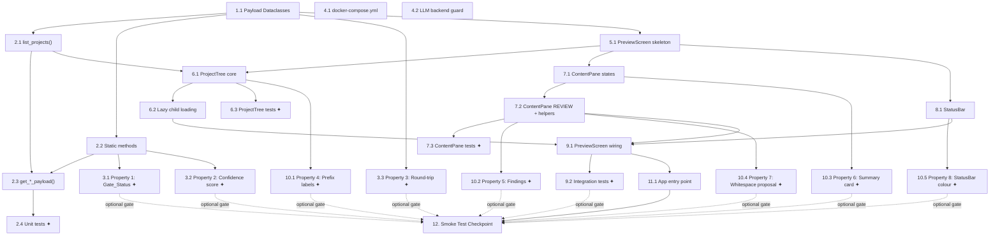

# Implementation Plan: TUI IDE Interface

## Overview

This plan implements `PreviewScreen` — a VS Code-inspired terminal IDE for
navigating project delivery data (Projects → Versions → Reviews →
Proposals / Prompts) — as a **purely additive** feature on top of the
existing Contexta application. Twelve milestones build incrementally from
pure-Python data contracts through to the live keyboard binding in
`ContextaApp`. All 596 + existing tests must remain green at every step.

**Language / framework:** Python 3.11 · Textual ≥ 0.47 · aiosqlite · Hypothesis

> Tasks marked `*` are optional and can be skipped for a faster MVP.
> Each task references requirements and design sections for full traceability.
> Dependency notation uses task IDs (e.g. _Depends on: 2.1, 2.2_).

---

## Tasks

<!-- ══════════════════════════════════════════════════════════════════ -->
<!-- Milestone 1: Node Payload Dataclasses                             -->
<!-- ══════════════════════════════════════════════════════════════════ -->
- [ ] 1. Node Payload Dataclasses — define data contracts first (zero risk, pure Python)
  - [ ] 1.1 Create `contexta/tui/preview_controller.py` with all Node_Payload dataclasses and `NodeMeta`
    - Define `FindingRow(dimension, confidence, summary, detail)` as `@dataclass(eq=True)`
    - Define `Project_Payload(id, name, global_tags, version_ids)` as `@dataclass(eq=True)`
    - Define `Version_Payload(id, project_id, name, created_at, node_ids)` as `@dataclass(eq=True)`

    - Define `Review_Payload(id, node_name, layer_type, findings, gate_status, delivery_confidence_score, prompt_text)` as `@dataclass(eq=True)`
    - Define `Proposal_Payload(id, node_id, content_markdown)` as `@dataclass(eq=True)`
    - Define `Prompt_Payload(id, node_id, prompt_text)` as `@dataclass(eq=True)`
    - Define `NodeMeta(node_type, node_id)` as `@dataclass` — stored as `TreeNode.data` in `ProjectTree`
    - No imports from `contexta.tui`, `contexta.pipeline`, `contexta.llm`, or `contexta.admin`
    - All payload dataclasses must be JSON-serialisable via `dataclasses.asdict()` + `json.dumps()`
    - _Requirements: 4.10, 5.3 · Design: "Data Models" section_
    - **Done when:** `python -c "from contexta.tui.preview_controller import Review_Payload, FindingRow; import dataclasses, json; r = Review_Payload('x','n','exploration',[],'PASS',100,''); print(json.dumps(dataclasses.asdict(r)))"` exits 0 producing valid JSON
    - _Complexity: S · Depends on: nothing_

<!-- ══════════════════════════════════════════════════════════════════ -->
<!-- Milestone 2: PreviewController                                    -->
<!-- ══════════════════════════════════════════════════════════════════ -->
- [ ] 2. PreviewController — thin async DB adapter with pure logic functions
  - [ ] 2.1 Implement `PreviewController.__init__` and `list_projects()`
    - `__init__(self, db_conn: aiosqlite.Connection)` stores `self._conn`; the connection is the sole external dependency and is never opened or closed by the controller
    - `list_projects()` calls `repositories.list_projects(conn)`, then `repositories.list_versions_for_project(conn, project.id)` for each project; returns `List[Project_Payload]`
    - DB exceptions propagate unmodified to the caller
    - _Requirements: 4.1, 4.9, 4.12 · Design: "PreviewController", "Mapping from DB Rows to Node_Payloads"_
    - **Done when:** `list_projects()` returns `[]` for an empty in-memory SQLite DB and a correctly-typed `Project_Payload` list after inserting a project row and its versions
    - _Complexity: M · Depends on: 1.1_
  - [ ] 2.2 Implement `_derive_gate_status()` and `_derive_confidence_score()` static methods
    - `_derive_gate_status(overall_confidence: ConfidenceEnum) -> str`: `{GREEN: "PASS", AMBER: "WARN", RED: "FAIL"}[confidence]` — complete, deterministic, no I/O
    - `_derive_confidence_score(findings: List[FindingRow]) -> int`: returns `0` for empty list; else `int(green_count / len(findings) * 100)` truncated toward zero
    - Both decorated `@staticmethod`; no side effects
    - _Requirements: 4.7, 4.8, 4.11 · Design: "PreviewController" section_
    - **Done when:** `_derive_gate_status(ConfidenceEnum.RED) == "FAIL"`, `_derive_confidence_score([]) == 0`, and for a mixed list of 1 GREEN + 1 RED finding the result is `50`
    - _Complexity: S · Depends on: 1.1_

  - [ ] 2.3 Implement `get_version_payload()`, `get_review_payload()`, `get_proposal_payload()`, `get_prompt_payload()`
    - `get_version_payload(version_id)` → `repositories.get_version()` + `repositories.list_nodes_for_project()` filtered by `version_id`; returns `Version_Payload` or `None`
    - `get_review_payload(node_id)` → `repositories.get_node()` → `ReviewNodePayload.model_validate_json(node.content_markdown)` → derive `gate_status` and `delivery_confidence_score`; converts each `IssueFinding` to `FindingRow`; returns `Review_Payload` or `None` for missing node; propagates DB exceptions unmodified
    - `get_proposal_payload(node_id)` → `repositories.get_node()`; returns `Proposal_Payload(id=node_id, node_id=node_id, content_markdown=node.content_markdown)` or `None`
    - `get_prompt_payload(node_id)` → `repositories.get_node()` → `ReviewNodePayload.model_validate_json(node.content_markdown).raw_llm_response`; returns `Prompt_Payload` or `None`
    - All four return `None` (not an exception) for a non-existent entity ID; DB exceptions propagate to caller without modification
    - _Requirements: 4.2–4.6, 4.12 · Design: "PreviewController", "Error Handling", "Mapping from DB Rows to Node_Payloads"_
    - **Done when:** Each method returns `None` for a missing ID and the correct typed payload for an existing row; `get_review_payload` with a closed connection re-raises the `aiosqlite` error unchanged
    - _Complexity: M · Depends on: 2.1, 2.2_
  - [ ]* 2.4 Write unit tests for `PreviewController` in `tests/test_preview_controller.py`
    - Async fixture: open `:memory:` aiosqlite DB, run `contexta/db/schema.sql` migrations, close after each test
    - Test: `list_projects()` → `[]` for empty DB
    - Test: `list_projects()` → correct `Project_Payload` list with `version_ids` populated after inserting project + version rows
    - Test: `get_review_payload("missing-id")` → `None`
    - Test: `get_review_payload(valid_id)` → `Review_Payload` with correct `gate_status` and `delivery_confidence_score`
    - Test: close DB connection then call any controller method; assert exception type is preserved (not swallowed)
    - Test: `get_version_payload("missing-id")` → `None`
    - _Requirements: 4.1–4.12 · Design: "Testing Strategy — Unit Tests: PreviewController"_
    - **Done when:** `pytest tests/test_preview_controller.py -v` exits 0 with all cases green
    - _Complexity: M · Depends on: 2.3_

<!-- ══════════════════════════════════════════════════════════════════ -->
<!-- Milestone 3: PreviewController Property Tests                     -->
<!-- ══════════════════════════════════════════════════════════════════ -->
- [ ] 3. PreviewController Property Tests — validate controller logic with Hypothesis
  - [ ]* 3.1 Write property test for Property 1 (Gate_Status mapping) in `tests/test_preview_controller_properties.py`
    - **Property 1: Gate_Status mapping is complete and deterministic**
    - `@given(st.sampled_from(list(ConfidenceEnum)))` — for every `ConfidenceEnum` member assert `_derive_gate_status(confidence)` equals the expected string from the static map; no unknown values are possible since all enum members are covered
    - **Validates: Requirements 4.7**
    - **Done when:** `pytest tests/test_preview_controller_properties.py::test_gate_status_mapping_complete -v` passes with ≥ 100 Hypothesis examples
    - _Complexity: S · Depends on: 2.2_
  - [ ]* 3.2 Write property test for Property 2 (Delivery_Confidence_Score formula) in `tests/test_preview_controller_properties.py`
    - **Property 2: Delivery_Confidence_Score is the correctly truncated GREEN percentage**
    - `@given(st.lists(st.builds(FindingRow, dimension=st.just("Intent"), confidence=st.sampled_from(["RED","AMBER","GREEN"]), summary=st.text(), detail=st.text())))` with `@settings(max_examples=200)` — assert `0` for empty list and `int(green_count / len(findings) * 100)` for non-empty; verify no rounding-up occurs
    - **Validates: Requirements 4.8, 4.11**
    - **Done when:** `pytest tests/test_preview_controller_properties.py::test_delivery_confidence_score_formula -v` passes with ≥ 200 examples
    - _Complexity: S · Depends on: 2.2_
  - [ ]* 3.3 Write property test for Property 3 (Review_Payload round-trip) in `tests/test_preview_controller_properties.py`
    - **Property 3: Review_Payload serialisation round-trip is lossless**
    - `@given(st.builds(Review_Payload, id=st.uuids().map(str), node_name=st.text(min_size=1), layer_type=st.sampled_from(["exploration","synthesis"]), findings=st.lists(st.builds(FindingRow,...)), gate_status=st.sampled_from(["PASS","WARN","FAIL"]), delivery_confidence_score=st.integers(0,100), prompt_text=st.text()))` with `@settings(max_examples=200)`
    - Serialise via `json.dumps(dataclasses.asdict(payload))`; deserialise; reconstruct `Review_Payload`; assert `reconstructed == payload`
    - **Validates: Requirements 4.10**
    - **Done when:** `pytest tests/test_preview_controller_properties.py::test_review_payload_round_trip -v` passes with ≥ 200 examples
    - _Complexity: S · Depends on: 1.1_

<!-- ══════════════════════════════════════════════════════════════════ -->
<!-- Milestone 4: Docker Compose                                        -->
<!-- ══════════════════════════════════════════════════════════════════ -->
- [ ] 4. Docker Compose — single-command zero-install deployment
  - [ ] 4.1 Create `docker-compose.yml` at the repository root
    - Single service `contexta` with `build: {context: ., dockerfile: Dockerfile}`
    - `stdin_open: true` and `tty: true` to enable terminal interaction
    - Named volume `contexta_data` mounted at `/data`; named volume `contexta_exports` mounted at `/exports`
    - `environment` block: `CONTEXTA_LLM_BACKEND=openai/gpt-4o`, `CONTEXTA_DB_PATH=/data/contexta.db`, `CONTEXTA_EXPORT_PATH=/exports`, `CONTEXTA_LOG_LEVEL=INFO` — each line with an inline YAML `#` comment explaining the variable's purpose and valid values
    - `volumes:` top-level block declaring both named volumes
    - _Requirements: 6.1–6.6 · Design: "Docker Compose Configuration" section_
    - **Done when:** `docker compose config` validates without errors and the file structure matches the design spec's YAML listing exactly (service name, volume names, stdin_open/tty, environment keys)
    - _Complexity: S · Depends on: nothing_
  - [ ] 4.2 Add `CONTEXTA_LLM_BACKEND` startup guard in `contexta/__main__.py`
    - In `_async_main()`, after constructing `app = ContextaApp(...)` and before `await app.run_async()`, add: `if not os.environ.get("CONTEXTA_LLM_BACKEND"): app.call_after_refresh(lambda: app.notify("CONTEXTA_LLM_BACKEND is not set — LLM-dependent features (pipeline review, proposal generation) will be unavailable.", severity="warning", title="Configuration Warning"))`
    - Application must start successfully even when the variable is absent or empty
    - No change to the normal startup path when the variable is set
    - _Requirements: 6.7 · Design: "Missing CONTEXTA_LLM_BACKEND Behaviour"_
    - **Done when:** Starting the app without `CONTEXTA_LLM_BACKEND` shows the warning notification and loads the TUI normally; starting with it set produces no warning
    - _Complexity: S · Depends on: nothing_

<!-- ══════════════════════════════════════════════════════════════════ -->
<!-- Milestone 5: PreviewScreen Skeleton                               -->
<!-- ══════════════════════════════════════════════════════════════════ -->
- [ ] 5. PreviewScreen Skeleton — layout wireframe with Header, Horizontal split, StatusBar dock
  - [ ] 5.1 Create `PreviewScreen` class in `contexta/tui/screens/preview_screen.py`
    - `__init__(self, controller: "PreviewController", **kwargs)` — stores `self._controller`; `PreviewController` referenced as a forward-reference string to avoid circular imports
    - `compose()` yields `Header(show_clock=False)`, a `Horizontal(id="preview-split")` container (with `ProjectTree` and `ContentPane` stub widgets), and `StatusBar(id="status-bar")`
    - `BINDINGS = [Binding("escape", "back", "Back", show=True, priority=True), Binding("q", "back", "Quit preview", show=False)]`
    - `action_back()` calls `self.app.pop_screen()`
    - `DEFAULT_CSS` implements the full layout and styling rules from the design: `PreviewScreen { layout: vertical }`, `#preview-split { height: 1fr; layout: horizontal }`, `ProjectTree { width: 28; background: $surface; border-right: solid $boost; padding: 0 1 }`, `ContentPane { width: 1fr; background: $panel; padding: 1 2 }`, `StatusBar { dock: bottom; height: 1; background: $surface; padding: 0 2; color: $text-muted }`, plus `.finding-row`, `.finding-dimension`, `.finding-red`, `.finding-amber`, `.finding-summary`, `.finding-detail`, `.monospace-area`, `.summary-card`, `.summary-label`, `.state-indicator`, `.state-error`
    - Zero imports from `contexta.pipeline`, `contexta.llm`, or `contexta.admin` — verified at module import time
    - _Requirements: 2.7, 2.9, 3.7, 5.1, 5.3 · Design: "Screen Layout Blueprint", "Textual CSS / Styling Strategy"_
    - **Done when:** `python -c "import contexta.tui.screens.preview_screen"` completes without triggering pipeline/llm/admin module-level initialisation; `PreviewScreen(controller=object()).compose()` is callable without error
    - _Complexity: S · Depends on: 1.1_

<!-- ══════════════════════════════════════════════════════════════════ -->
<!-- Milestone 6: ProjectTree Widget                                   -->
<!-- ══════════════════════════════════════════════════════════════════ -->
- [ ] 6. ProjectTree Widget — VS Code-style collapsible tree with type prefixes and NodeSelected message
  - [ ] 6.1 Implement `ProjectTree` core: `NodeSelected` message, `_format_label()`, and loading / empty / error states
    - Inner class `NodeSelected(Message)` with `node_type: str` and `node_id: str` attributes; posted via `self.post_message(ProjectTree.NodeSelected(meta.node_type, meta.node_id))`
    - `_format_label(node_type: str, name: str) -> str` static method — returns `"[P] {name}"` for `"project"`, `"[V]"` for `"version"`, `"[R]"` for `"review"`, `"[D]"` for `"proposal"`, `"[T]"` for `"prompt"`
    - `on_mount()` mounts `Static("Loading projects…", classes="state-indicator")` then `run_worker(self._load_projects(), exclusive=True, name="load-projects")`
    - `_load_projects()` calls `self._controller.list_projects()`; on success with non-empty list mounts `Tree[NodeMeta]` with root nodes; on empty list replaces indicator with `Static("No projects found. Run a review to get started.", classes="state-indicator")`; on exception replaces indicator with `Static(f"Could not load projects: {exc}", classes="state-error")`
    - `on_tree_node_selected(event: Tree.NodeSelected)` reads `event.node.data` as `NodeMeta` and posts `ProjectTree.NodeSelected`
    - _Requirements: 1.1, 1.7, 1.8, 1.9, 1.10, 1.11 · Design: "ProjectTree", "Loading and Error States — ProjectTree States"_
    - **Done when:** `_format_label("project","Alpha") == "[P] Alpha"`, `_format_label("prompt","Prompt") == "[T] Prompt"` for all five node types; `NodeSelected` message carries the correct attributes
    - _Complexity: M · Depends on: 5.1, 2.1_
  - [ ] 6.2 Implement lazy child loading in `ProjectTree`
    - `self._loaded_nodes: set[str]` initialised to `set()` in `__init__` or `on_mount`
    - `_on_tree_node_expanded(event: Tree.NodeExpanded)` checks `event.node.data.node_id not in self._loaded_nodes`; if true, calls `run_worker(self._load_children(event.node, meta), name=f"load-{meta.node_id}")`
    - `_load_children(node, meta)` dispatches on `meta.node_type`: for `"project"` fetches versions via `controller.list_projects()` filtered by project id; for `"version"` fetches review nodes; for `"review"` fetches proposal and prompt leaf children using `get_proposal_payload` and `get_prompt_payload`
    - After loading completes, adds `meta.node_id` to `self._loaded_nodes`
    - Subsequent collapse/re-expand cycles use already-mounted children without any new controller call
    - _Requirements: 1.2, 1.3, 1.4, 1.5, 1.6 · Design: "ProjectTree — Lifecycle", "Expanded/Collapsed State Preservation"_
    - **Done when:** Expanding a project node fetches its children exactly once; a second expand after collapse does not trigger a new controller call (verified by counting controller invocations with a stub)
    - _Complexity: M · Depends on: 6.1_
  - [ ]* 6.3 Write unit tests for `ProjectTree._format_label()` and `NodeSelected` message
    - Test all five `node_type` values produce the correct prefix: `"[P]"`, `"[V]"`, `"[R]"`, `"[D]"`, `"[T]"`
    - Test that `_format_label("project", "Alpha Corp") == "[P] Alpha Corp"` (name is preserved verbatim)
    - Test `NodeSelected` carries `node_type` and `node_id` exactly as provided at construction
    - _Requirements: 1.7, 1.8 · Design: "ProjectTree — Label format" table_
    - **Done when:** New tests pass and `pytest tests/ -v` exits 0 with all 596 + prior tests still green
    - _Complexity: S · Depends on: 6.1_

<!-- ══════════════════════════════════════════════════════════════════ -->
<!-- Milestone 7: ContentPane Widget                                   -->
<!-- ══════════════════════════════════════════════════════════════════ -->
- [ ] 7. ContentPane Widget — state machine (WELCOME / LOADING / PROJECT / VERSION / REVIEW / ERROR) with TabbedContent
  - [ ] 7.1 Implement `ContentPane` with WELCOME, LOADING, PROJECT, VERSION, and ERROR states
    - `show_welcome()` removes existing children; mounts `Static` welcome card listing ESC and Q keyboard shortcuts
    - `show_loading()` removes existing children; mounts `Static("Fetching…", classes="state-indicator")`
    - `show_project(payload: Project_Payload)` removes existing children; mounts a `Static` summary card containing `payload.name`, the label `"Project"`, `"N/A"` for timestamp, and a bulleted list of `version_ids` or the text `"No items"` if empty
    - `show_version(payload: Version_Payload)` removes existing children; mounts a `Static` summary card containing `payload.name`, the label `"Version"`, `payload.created_at` (or `"N/A"` if blank), and bulleted `node_ids` or `"No items"`
    - `show_error(message: str)` removes existing children; mounts `Static(message, classes="state-error")`
    - `on_mount()` calls `show_welcome()`
    - _Requirements: 2.7, 2.8, 2.9, 2.10, 2.11 · Design: "ContentPane", "Loading and Error States — ContentPane States"_
    - **Done when:** Calling `show_welcome()` then `show_loading()` leaves only the loading indicator as a child; `show_error("x")` always replaces prior content; summary card text contains required fields (verified via `.renderable` or direct string inspection in unit tests)
    - _Complexity: M · Depends on: 5.1_
  - [ ] 7.2 Implement `ContentPane.show_review()` and REVIEW state rendering helpers
    - `show_review(payload: Review_Payload, active_tab: str = "Findings")` removes existing children; mounts `TabbedContent` with panes "Findings" (default active), "Proposal", "Prompt"; sets the active tab via `TabbedContent.active`
    - `_render_findings(findings: List[FindingRow])` returns a list of widgets — one per finding — each containing: dimension label with `text-style: bold`, confidence badge with Textual colour markup (`[red]RED[/red]` for RED findings, `[yellow]AMBER[/yellow]` for AMBER, no markup for GREEN), a `Rule` divider, summary `Static`, and detail `Static` with class `"finding-detail"`; `"finding-row"` CSS class on the outer container
    - `_is_empty_proposal(content_markdown: str) -> bool` returns `True` iff `content_markdown.strip() == ""`
    - `_render_proposal(content_markdown: str)` returns `Static("No proposal generated for this review.")` when `_is_empty_proposal` is `True`; otherwise returns `Markdown(content_markdown)`
    - `_render_prompt(prompt_text: str)` wraps `Static(prompt_text)` in a `ScrollableContainer` with class `"monospace-area"`
    - When `node_type in ("proposal", "prompt")` is selected in `PreviewScreen`, `show_review()` is called with `active_tab="Proposal"` or `active_tab="Prompt"` respectively
    - _Requirements: 2.1, 2.2, 2.3, 2.4, 2.5, 2.6, 2.7 · Design: "ContentPane", "Findings tab rendering", "Proposal tab rendering", "Prompt tab rendering"_
    - **Done when:** `_is_empty_proposal("")` is `True`; `_is_empty_proposal("  \n\t ")` is `True`; `_is_empty_proposal("content")` is `False`; `_render_findings([FindingRow("Intent","RED","s","d")])` produces markup containing `"Intent"`, `"RED"`, and `"red"`
    - _Complexity: L · Depends on: 7.1_
  - [ ]* 7.3 Write unit tests for `ContentPane` rendering helpers
    - Test `_is_empty_proposal("")` → `True`
    - Test `_is_empty_proposal("   \n\t  ")` → `True`
    - Test `_is_empty_proposal("content")` → `False`
    - Test `_render_findings([])` returns an empty list (no sections rendered)
    - Test `_render_findings([FindingRow("Intent","RED","summary","detail")])` returns one section whose rendered text contains `"Intent"`, `"RED"`, and red colour markup
    - Test `_render_findings([FindingRow("Scope","GREEN","summary","detail")])` contains `"Scope"` but no `"[red]"` or `"[yellow]"` markup
    - _Requirements: 2.2, 2.3, 2.5 · Design: "Testing Strategy — Property-Based Tests: TUI Rendering Helpers"_
    - **Done when:** `pytest tests/ -k "contentpane" -v` passes green; all pre-existing tests remain passing
    - _Complexity: M · Depends on: 7.2_

<!-- ══════════════════════════════════════════════════════════════════ -->
<!-- Milestone 8: StatusBar Widget                                     -->
<!-- ══════════════════════════════════════════════════════════════════ -->
- [ ] 8. StatusBar Widget — single-line docked footer with semantic gate-status colours
  - [ ] 8.1 Implement `StatusBar` widget with `show_review_status()` and `show_no_selection()`
    - `DEFAULT_CSS`: `StatusBar { dock: bottom; height: 1; background: $surface; padding: 0 2; color: $text-muted }`
    - `show_review_status(gate_status, confidence_score, node_name, version_name, project_name)` updates `self.update(...)` with: `f"● [{colour}]{gate_status}[/{colour}]  {confidence_score}%   Node: {node_name}  ·  Version: {version_name}  ·  Project: {project_name}"` where `colour = "green"` for `"PASS"`, `"yellow"` for `"WARN"`, `"red"` for `"FAIL"`
    - `show_no_selection()` updates with `"— No node selected —"` using default text colour
    - `on_mount()` calls `show_no_selection()`
    - `StatusBar` extends `Static` (or `Widget` with internal `Static`)
    - _Requirements: 3.1–3.7 · Design: "StatusBar", "Gate_Status colour mapping" table_
    - **Done when:** `show_review_status("FAIL", 33, "Scope", "v1.0", "Alpha")` produces markup string containing `"[red]FAIL[/red]"` and `"33%"`; `show_review_status("PASS", 100, ...)` uses `"[green]PASS[/green]"`; `show_no_selection()` renders `"— No node selected —"`
    - _Complexity: S · Depends on: 5.1_

<!-- ══════════════════════════════════════════════════════════════════ -->
<!-- Milestone 9: PreviewScreen Integration                            -->
<!-- ══════════════════════════════════════════════════════════════════ -->
- [ ] 9. PreviewScreen Integration — wire ProjectTree → PreviewScreen → Controller → ContentPane + StatusBar event flow
  - [ ] 9.1 Implement `PreviewScreen.on_project_tree_node_selected()` and `_fetch_and_display()`
    - `on_project_tree_node_selected(event: ProjectTree.NodeSelected)` calls `self.query_one("#content-pane", ContentPane).show_loading()` then `self.run_worker(self._fetch_and_display(event.node_type, event.node_id), exclusive=True, name="preview-fetch")`
    - `_fetch_and_display(node_type, node_id)` dispatches on `node_type`:
      - `"review"` → `get_review_payload(node_id)` → `ContentPane.show_review(payload)` + `StatusBar.show_review_status(gate_status, score, node_name, version_name, project_name)`
      - `"project"` → find project from `list_projects()` by id → `ContentPane.show_project(payload)` + `StatusBar.show_no_selection()`
      - `"version"` → `get_version_payload(node_id)` → `ContentPane.show_version(payload)` + `StatusBar.show_no_selection()`
      - `"proposal"` → `get_review_payload(node_id)` → `ContentPane.show_review(payload, active_tab="Proposal")` + `StatusBar.show_review_status(...)`
      - `"prompt"` → `get_review_payload(node_id)` → `ContentPane.show_review(payload, active_tab="Prompt")` + `StatusBar.show_review_status(...)`
    - Any exception from the controller is caught with `except Exception as exc`; calls `ContentPane.show_error(str(exc))` and `StatusBar.show_no_selection()`; exception is never re-raised into the Textual event loop
    - When `get_*_payload()` returns `None`, `ContentPane.show_error("Review data not available.")` is called
    - _Requirements: 2.10, 2.11, 3.1, 3.2, 5.1, 5.2, 5.4, 5.6 · Design: "PreviewScreen", "State Management — Selection Event Flow", "Error Handling — PreviewScreen"_
    - **Done when:** Selecting a review node in tests with a stub controller results in `ContentPane.show_review()` being called; exceptions from the stub controller result in `ContentPane.show_error()` not a propagated exception; existing 596 + tests remain green after wiring
    - _Complexity: M · Depends on: 6.2, 7.2, 8.1_
  - [ ]* 9.2 Write integration tests for `PreviewController` against a real in-memory DB
    - `test_list_projects_integration`: insert 2 projects each with 1 version; call `list_projects()`; assert both returned with correct `version_ids`
    - `test_get_review_payload_integration`: write a `ReviewNodePayload` via `write_node()`; call `get_review_payload(node_id)`; assert `gate_status`, `delivery_confidence_score`, and `findings` are correct
    - `test_get_review_payload_none_for_missing`: call `get_review_payload("nonexistent")`; assert `None` returned
    - `test_exception_propagates`: close the DB connection; call any controller method; assert the original exception type is preserved
    - _Requirements: 4.1–4.12 · Design: "Testing Strategy — Integration Tests"_
    - **Done when:** `pytest tests/test_preview_controller.py -k "integration" -v` exits 0
    - _Complexity: M · Depends on: 9.1_

<!-- ══════════════════════════════════════════════════════════════════ -->
<!-- Milestone 10: TUI Rendering Property Tests                        -->
<!-- ══════════════════════════════════════════════════════════════════ -->
- [ ] 10. TUI Rendering Property Tests — Hypothesis tests for label formatting and findings rendering helpers
  - [ ]* 10.1 Write property test for Property 4 (node type prefix labels) in `tests/test_tui_rendering_properties.py`
    - **Property 4: Node type prefix labels are correct for all node types**
    - `@given(node_type=st.sampled_from(["project","version","review","proposal","prompt"]), name=st.text(min_size=1))` — assert `ProjectTree._format_label(node_type, name).startswith(PREFIX_MAP[node_type])` and that `name` appears in the label
    - **Validates: Requirements 1.7**
    - **Done when:** `pytest tests/test_tui_rendering_properties.py::test_node_prefix_label -v` passes with ≥ 100 examples
    - _Complexity: S · Depends on: 6.1_
  - [ ]* 10.2 Write property test for Property 5 (findings rendered completely) in `tests/test_tui_rendering_properties.py`
    - **Property 5: Findings rows are fully and correctly rendered for all findings**
    - `@given(st.lists(st.builds(FindingRow,...), min_size=1))` with `@settings(max_examples=100)` — call `ContentPane._render_findings(findings)` (or a standalone helper); assert `len(sections) == len(findings)`; for each finding assert `dimension`, `confidence`, and `summary` appear in the section text; for RED assert red markup; for AMBER assert yellow/amber markup; for GREEN assert no red/yellow markup
    - **Validates: Requirements 2.2, 2.3**
    - **Done when:** `pytest tests/test_tui_rendering_properties.py::test_findings_rendered_completely -v` passes with ≥ 100 examples
    - _Complexity: M · Depends on: 7.2_
  - [ ]* 10.3 Write property test for Property 6 (summary card fields) in `tests/test_tui_rendering_properties.py`
    - **Property 6: Summary card contains all required fields for any Project or Version payload**
    - For `Project_Payload`: `@given(st.builds(Project_Payload,...))` — assert rendered text contains `payload.name` and `"Project"`; for `Version_Payload`: assert rendered text contains `payload.name`, `"Version"`, and `payload.created_at` (or `"N/A"`)
    - **Validates: Requirements 2.8**
    - **Done when:** `pytest tests/test_tui_rendering_properties.py::test_summary_card_fields -v` passes with ≥ 100 examples
    - _Complexity: S · Depends on: 7.1_
  - [ ]* 10.4 Write property test for Property 7 (whitespace proposal shows placeholder) in `tests/test_tui_rendering_properties.py`
    - **Property 7: Proposal tab shows placeholder for any whitespace-only content_markdown**
    - `@given(st.text(alphabet=st.characters(whitelist_categories=["Zs","Cc"]), min_size=0))` — assert `ContentPane._is_empty_proposal(whitespace_content) is True` for all whitespace strings including empty string
    - **Validates: Requirements 2.5**
    - **Done when:** `pytest tests/test_tui_rendering_properties.py::test_whitespace_proposal_shows_placeholder -v` passes with ≥ 100 examples
    - _Complexity: S · Depends on: 7.2_
  - [ ]* 10.5 Write property test for Property 8 (StatusBar colour matches gate status) in `tests/test_tui_rendering_properties.py`
    - **Property 8: StatusBar colour class matches gate status for all valid values**
    - `@given(gate_status=st.sampled_from(["PASS","WARN","FAIL"]), score=st.integers(0,100), node_name=st.text(min_size=1), version_name=st.text(min_size=1), project_name=st.text(min_size=1))` — call `StatusBar.show_review_status(gate_status, score, ...)` and assert the rendered markup contains the correct colour tag: `"PASS"` → `"[green]"`, `"WARN"` → `"[yellow]"`, `"FAIL"` → `"[red]"`
    - **Validates: Requirements 3.3, 3.4, 3.5**
    - **Done when:** `pytest tests/test_tui_rendering_properties.py::test_statusbar_colour_matches_gate_status -v` passes with ≥ 100 examples
    - _Complexity: S · Depends on: 8.1_

<!-- ══════════════════════════════════════════════════════════════════ -->
<!-- Milestone 11: App Entry Point                                     -->
<!-- ══════════════════════════════════════════════════════════════════ -->
- [ ] 11. App Entry Point — register PreviewScreen and add keyboard binding to launch from MainScreen
  - [ ] 11.1 Register `PreviewScreen` in `ContextaApp` and add a keyboard binding in `MainScreen`
    - In `ContextaApp.on_mount()`, lazy-import and install `PreviewScreen` as a named screen: `self.install_screen(PreviewScreen(controller=PreviewController(self._db_conn)), name="preview")` — guarded so it only installs when `self._db_conn` is not `None`
    - In `MainScreen.BINDINGS`, add `Binding("v", "preview", "[V] Preview", show=True, priority=True)`
    - In `MainScreen`, add `action_preview(self) -> None: self.app.push_screen("preview")`
    - No changes to `MainScreen`'s existing bindings or layout; the new `[V]` action appears in the existing footer
    - _Requirements: 5.5 (implied — screen must be navigable); Design: "Architecture" section_
    - **Done when:** Pressing `V` in the running application pushes `PreviewScreen`; pressing `ESC` or `Q` inside `PreviewScreen` returns to `MainScreen`; all 596 + existing tests remain green (`pytest tests/` exits 0)
    - _Complexity: S · Depends on: 9.1_

<!-- ══════════════════════════════════════════════════════════════════ -->
<!-- Milestone 12: Smoke Test & Coverage Check (Checkpoint)           -->
<!-- ══════════════════════════════════════════════════════════════════ -->
- [ ] 12. Smoke Test & Coverage Check — verify 596 + tests still pass, coverage still ≥ 90%
  - Run `pytest tests/ --tb=short` and confirm: exit code 0; zero items reported as `ERROR` or `FAILED`; final session summary shows ≥ 596 tests passed
  - Run `pytest tests/ --cov=contexta --cov-report=term-missing` and confirm reported coverage is ≥ 90%; the existing `omit = ["contexta/__main__.py", "contexta/tui/*"]` glob in `pyproject.toml` already excludes all new TUI files — no `pyproject.toml` change is required
  - If any prior test is broken, fix the root cause in the new files (not in the existing test files) before completing this milestone
  - _Requirements: 7.1, 7.2, 7.3, 7.4 · Design: "Testing Strategy — Running the Tests"_
  - **Done when:** `pytest tests/` exits 0 with ≥ 596 tests passing and coverage report shows ≥ 90%

---

## Notes

- Tasks marked `*` are optional and can be skipped for a faster MVP; the core implementation tasks are all required
- Each task references specific requirements clauses for traceability (e.g., _Requirements: 4.7_)
- **Zero business logic in TUI layer**: `ProjectTree`, `ContentPane`, and `StatusBar` receive pre-computed values from `PreviewController` and render them — no re-computation in widgets
- **Additive only**: `MainScreen`, `ContextaApp`, and all existing pipeline/pipeline files are touched only in tasks 4.2 and 11.1, which are strictly additive (no deletions or modifications to existing logic)
- **Coverage**: `pyproject.toml` already contains `omit = ["contexta/__main__.py", "contexta/tui/*"]` — all new files under `contexta/tui/` are automatically excluded from coverage measurement; the ≥ 90% threshold is unaffected
- **Checkpoints**: Milestone 12 is the explicit smoke-test checkpoint; informally, each milestone can be validated by running `pytest tests/` to confirm no regressions before moving to the next
- Hypothesis `asyncio_mode = "auto"` is already configured in `pyproject.toml` — no configuration change needed for async property tests
- The stub controller pattern for `PreviewScreen` unit tests: implement a `StubPreviewController` class in the test file with the same async method signatures returning pre-built `Node_Payload` instances; inject it at `PreviewScreen(controller=StubPreviewController())`

---

## Task Dependency Graph

> **Graph legend:**
> Solid arrows `-->` indicate required ordering (the upstream task must be complete before the downstream one begins).
> Dashed arrows `-.->` indicate optional quality gates: these test tasks feed into the final checkpoint but can be skipped for a faster MVP build.
> Milestones **4.1** and **4.2** (Docker Compose) have no upstream code dependencies and can be completed at any point in parallel with other milestones.
